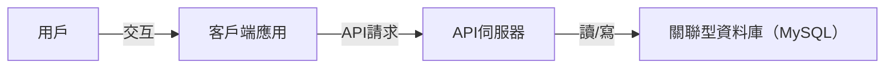
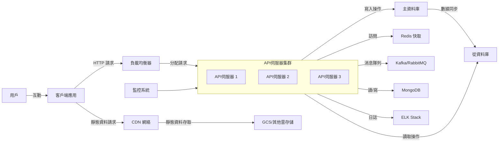

## 有關本專案
### 使用方式
1. **啟用 docker**
```
docker compose up -d 
// 在 http://127.0.0.1:9501 起服務
// DB host: 127.0.0.1, port: 3307
```

2. **跑 migrate** 
```
docker exec -it laravel-swoole-app bash
php artisan migrate
```

### API
1. **新增訂單**
```
// request
curl --location 'http://127.0.0.1:9501/api/v1/orders' \
--header 'Content-Type: application/json' \
--header 'Cookie: laravel_session=ToYzqvnQUrvLZRi1IN472DGM2Hg09Lg1kwA75WrH' \
--data '{
    "id": "A0000003",
    "name": "Melody Holiday Inn",
    "address": {
        "city": "taipei-city",
        "district": "da-an-district",
        "street": "fuxing-south-road"
    },
    "price": "2050",
    "currency": "USD"
}'

// response
{
    "status": "Order created successfully",
    "order_id": "A0000003"
}
```

2. **查詢訂單**
```
// request
curl --location --request GET 'http://127.0.0.1:9501/api/v1/orders/A0000003?currency=USD' \
--header 'Content-Type: application/json' \
--header 'Cookie: laravel_session=ToYzqvnQUrvLZRi1IN472DGM2Hg09Lg1kwA75WrH' \
--data '{
    "id": "A0000001",
    "name": "Melody Holiday Inn",
    "address": {
        "city": "taipei-city",
        "district": "da-an-district",
        "street": "fuxing-south-road"
    },
    "price": "2050",
    "currency": "USD"
}'

// response
{
    "id": 3,
    "order_id": "A0000003",
    "address_id": 9,
    "price": "2050.00",
    "created_at": "2024-10-15 16:17:23",
    "updated_at": "2024-10-15 16:17:23"
}
```

### 本專案中用到的的 SOLID 原則
1. **單一職責原則 (SRP)**：
    - `OrderRequest` 僅處理 Request 驗證   
    - `OrderController` 僅負責收 HTTP 請求。
    - `OrderService` 來處理創建訂單的業務邏輯。

2. **里氏替換原則 (LSP)**：
   - `OrderRequest` 繼承了 FormRequest，這意味著它可以被用作一個請求類，並且可以在 Laravel 的控制器中被用作請求驗證。

3. **接口隔離原則 (ISP)**：
   - `OrderRequest`  它只包含與訂單請求驗證相關的方法。而不需要依賴於不相關的驗證規則。

4. **依賴倒置原則 (DIP)**：
   - `OrderController` 依賴於抽象（接口），通過構造函數中的依賴注入來實現。

### 本專案中的設計模式
1. **單例模式 (Singleton Pattern)**
應用：在 App\Providers\EventServiceProvider 中，事件和監聽器的註冊是通過 Service Container 進行的。此時 Laravel 會確保該Service Provider 的實例在整個 process 中是唯一的。

2. **依賴注入 (Dependency Injection)**
應用：在 OrderController 中，通過構造函數注入 OrderService，這是一種依賴注入的實現。這樣的設計使得 OrderController 不需要知道 OrderService 的具體實現，從而提高了可測試性和可維護性。

3. **觀察者模式 (Observer Pattern)**
應用：在 OrderCreatedListener 中，使用了 Laravel 的事件系統。當訂單創建時，會觸發 OrderCreated 事件，並由 OrderCreatedListener 來處理。這種模式使得應用程序的不同部分可以解耦，並且可以輕鬆地添加或移除事件處理器。


## 資料庫測驗
### 題目一
請寫出一條 SQL 查詢語句,列出在 2023 年 5 月下訂的訂單,使用台幣 (TWD) 付款且 5 月總金
額最多的前 10 筆的 bnb_id、bnb_name,以及 5 月各旅宿總金額 (may_amount)。
```sql
SELECT 
    b.bnb_id, 
    b.name AS bnb_name,
    SUM(o.amount) AS may_amount
FROM 
    orders o
JOIN 
    bnbs b ON o.bnb_id = b.id
WHERE 
    o.currency = 'TWD'
    AND o.created_at >= '2023-05-01' 
    AND o.created_at < '2023-06-01'
GROUP BY 
    b.bnb_id
ORDER BY 
    may_amount DESC
LIMIT 10;
```

### 題目二
在題目一的執行下,我們發現 SQL 執行速度很慢,您會怎麼去優化?請闡述您怎麼判斷與優化
的方式
1. 使用 EXPLAIN 來分析 SQL 查詢的執行計劃，以了解哪一步驟需要較多的時間。
根據結果，可以判斷是否需要額外的索引或其他優化策略。

2. 加入 index
第一步可能會發現 orders 表上的 created_at、currency 欄位可建立index，因為 WHERE 條件中有用到日期和貨幣篩選。
在 orders 表的 bnb_id 欄位建 index
或在 bnbs 表的 id 欄位也應該建立索引
因為這是 JOIN 條件，也可以加速搜尋

3. 拆成兩次查詢 減少 JOIN 操作
```查詢1
SELECT 
    bnb_id, 
    SUM(amount) AS may_amount
FROM 
    orders
WHERE 
    currency = 'TWD'
    AND created_at >= '2023-05-01' 
    AND created_at < '2023-06-01'
GROUP BY 
    bnb_id
ORDER BY 
    may_amount DESC
LIMIT 10;
```
```查詢2
SELECT 
    bnb_id, 
    name AS bnb_name
FROM 
    bnbs
WHERE 
    bnb_id IN (<上一次查詢獲得的 bnb_id 列表>);
```

## 架構測驗
以下是一個兩階段的線上通訊服務規劃，設計從 MVP 到支持大規模用戶與高並發的系統擴展。

---

### 第1階段：MVP（最小可行產品）驗證

#### 目標：
開發一個具備核心功能的通訊應用，快速投入市場，以驗證產品理念和用戶需求。

#### 主要任務：
##### 需求確定：
- 確定 MVP 的核心功能：
   - 用戶註冊/登錄
   - 一對一文字聊天
   - 好友添加與管理

##### 技術選擇：
- **前端**：根據團隊技術，選擇使用 React.js。
-  **後端**：根據團隊技術，選擇使用 Laravel 開發 API 服務。
-  **資料庫**：使用基本的關聯型資料庫（如 MySQL）儲存用戶資料和對話訊息。

##### 架構設計：
搭建基本的客戶端-伺服器架構，確保後續系統可擴展性。



##### 開發實施：
- **用戶 module**：實現用戶註冊、登錄、密碼找回功能。
- **聊天 module**：使用 WebSocket 支援一對一即時文字聊天。
- **好友 module**：實現好友添加、刪除等功能。

##### 基本安全措施：
- 實現 HTTPS 加密傳輸，保護用戶數據。
- 設置基本的 OAuth 身份驗證機制。

---

### 第2階段：應對大流量

#### 目標：
優化系統性能，提升架構以支持高併發和大規模用戶訪問。

#### 主要任務：
##### 架構升級：
將系統升級為支持高併發的分佈式架構，並引入各種性能優化技術。


##### 資料庫優化：
- 引入 NoSQL 資料庫（如 MongoDB）來儲存非結構化數據。
- 實現資料庫讀寫分離，使用主從複製與分片技術來提升性能。

##### Cache 機制：
- 使用 Redis 快取熱門數據，降低資料庫的讀取壓力，提升查詢性能。

##### 負載均衡：
- 使用 GCP/Amazon 的負載均衡器（Load Balancer）來分配 HTTP 請求，均衡 API 伺服器的負載。

##### CDN 加速：
- 使用 CDN 來加速靜態資源的加載，如圖片、CSS、JavaScript 文件等。

##### 消息隊列：
- 引入 Kafka 或 RabbitMQ 來處理異步任務，提升系統的響應速度，減少伺服器負載。

##### 容器化與自動化部署：
- 使用 Docker 將各個服務容器化，便於部署與管理。
- 使用 Kubernetes 進行容器編排與自動擴容，確保系統可以隨時擴展。

##### 監控與日誌：
- 使用 Prometheus 和 Grafana 部署監控系統，實時監控系統性能。
- 使用 ELK Stack（Elasticsearch、Logstash、Kibana）收集與分析系統日誌，便於故障排查。
